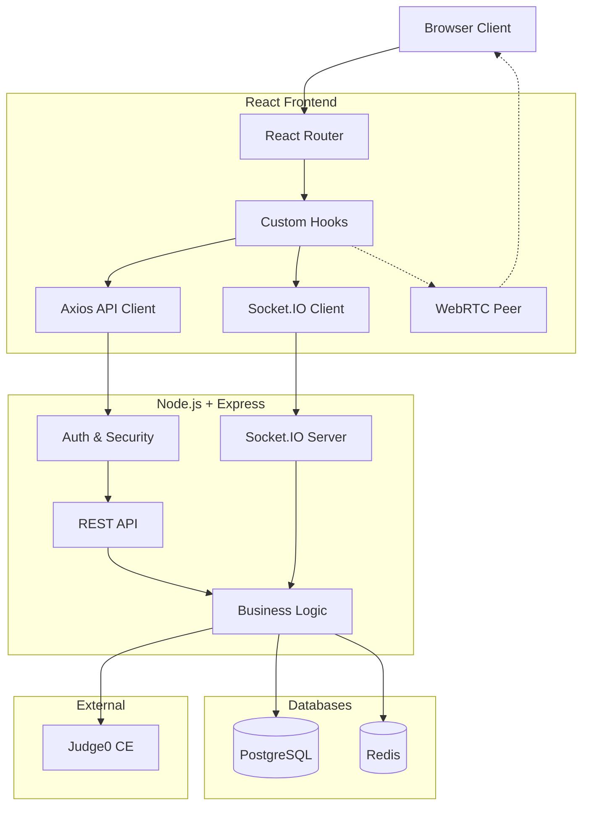
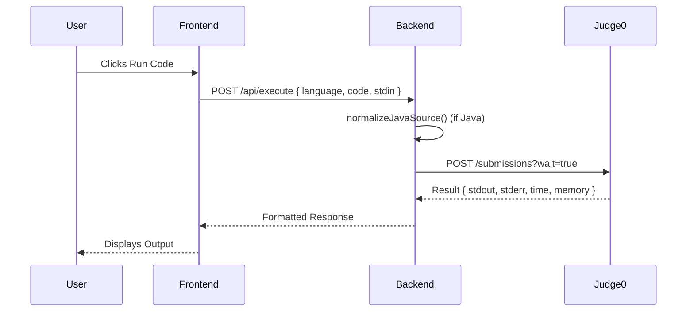

# CodeCall System Architecture

CodeCall is a full-stack real-time collaborative coding platform designed for high performance, modularity, and security.

---

## 1. System Overview

---

## 2. Component Architecture

### 2.1 Frontend Architecture (React + Vite)
The frontend follows a layered hook-based architecture to separate UI from real-time logic.

- **UI Components:** Stateless and stateful React components (e.g., `CodeEditor`, `Whiteboard`, `DSACanvas`).
- **Custom Hooks:** Real-time state management.
  - `useCodeExecution()`: Syncs editor state and triggers Judge0.
  - `useChat()`: Manages in-room messaging.
  - `useWhiteboard()`: Canvas event syncing.
  - `useWebRTC()`: Media stream management and peer-to-peer signaling.
- **Services:**
  - `api/`: Axios instances with interceptors for JWT injection.
  - `socket/`: Singleton Socket.IO client instance.

### 2.2 Backend Architecture (Node.js + Express)
The backend follows a Controller-Service-Repository pattern (via Prisma) with a modular structure.

- **API Layer (Controllers/Routes):** Handles HTTP parsing and response formatting.
- **Service Layer:** Pure business logic. Independent of HTTP context.
- **Middleware:** Security, rate-limiting, request validation, and auth enforcement.
- **Real-time Layer (Sockets):** Separate namespace handlers (`chat`, `code`, `board`, `webrtc`) mounted on a single Socket.IO server.

---

## 3. Real-time Communication Strategy

CodeCall utilizes a hybrid communication approach:

1. **REST API:** Used for persistent operations (Auth, Project CRUD, Room CRUD).
2. **WebSockets (Socket.IO):** Used for low-latency synchronization:
   - Code changes (operational transform-like diffs via Monaco).
   - Canvas drawing events.
   - Chat messages.
   - WebRTC signaling (SDP offers/answers, ICE candidates).
3. **WebRTC:** Used strictly for peer-to-peer video/audio streams to reduce server bandwidth.

---

## 4. Data Storage & Modeling

### 4.1 Relational Database (PostgreSQL)
Managed via **Prisma ORM**. Key entities:
- `User`: Authentication and profile data.
- `Project`: Workspaces owning multiple rooms.
- `ProjectMember`: Join table for Role-Based Access Control (RBAC).
- `Room`: Individual collaborative sessions with lifecycle tracking (`status`, `lastActivity`).
- `RoomParticipant`: Join table tracking user attendance.

### 4.2 In-Memory / Caching (Redis)
- **Rate Limiting:** IP-based tracking via `express-rate-limit` + Redis store.
- **Background Jobs:** Handled via BullMQ (planned for email/analytics).

---

## 5. Security Architecture

1. **Authentication:** 
   - Short-lived Access Tokens (JWT, 15m).
   - Long-lived Refresh Tokens stored securely in the database.
2. **Authorization:** 
   - Role-Based Access Control (RBAC) at the route level via middleware.
   - Resource-level checks in the service layer (e.g., "Is user a member of this project?").
3. **Input Validation:** Strict runtime schema validation using **Zod** for all incoming REST payloads and Socket events.
4. **Transport Security:** Helmet.js for HTTP headers, CORS policies restricted to specific origins.
5. **Execution Sandbox:** Untrusted user code is strictly sandboxed by delegating execution to the isolated **Judge0 CE** container environment.

---

## 6. Code Execution Pipeline

To prevent Java execution failures, the backend intercepts Java code and automatically renames the primary class to `Main` before sending it to Judge0.

---

## 7. Scaling Considerations

- **Horizontal Scaling:** The Node.js server is stateless. Socket.IO can be scaled horizontally by introducing a Redis Adapter for pub/sub message routing between instances.
- **Database:** Prisma connection pooling handles concurrent Postgres connections.
- **Execution:** Judge0 workers can be scaled independently of the main API server based on queue length.