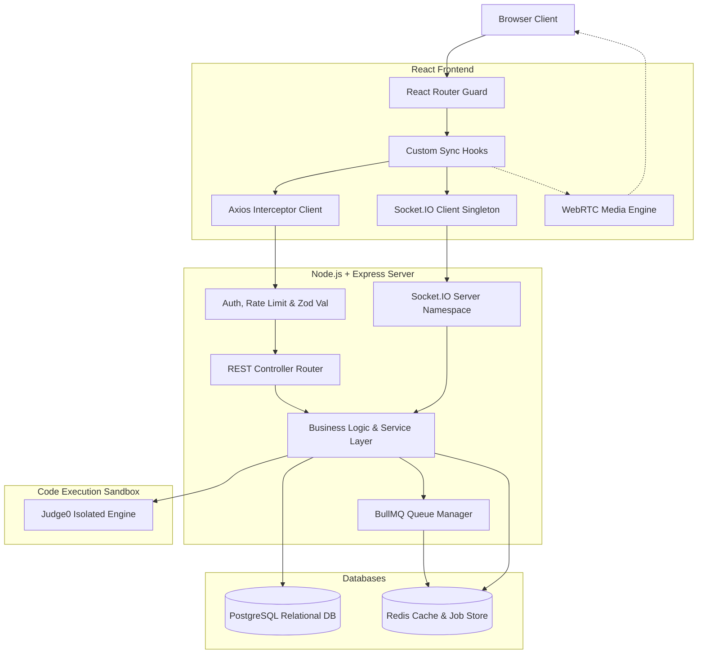
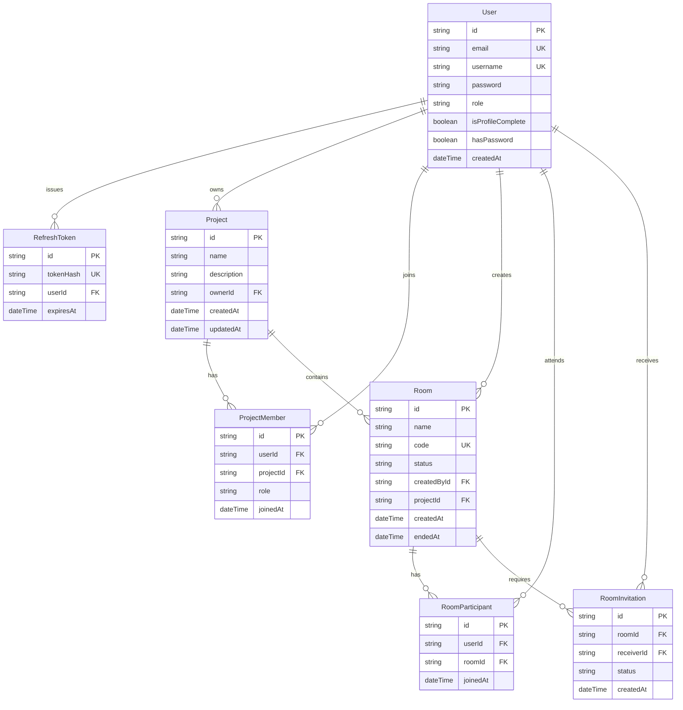
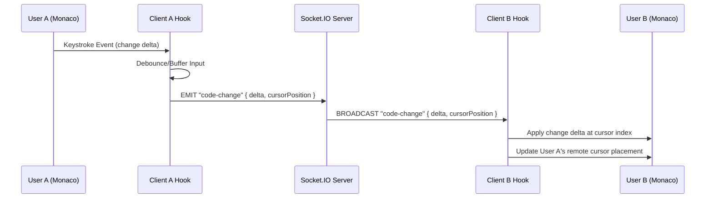
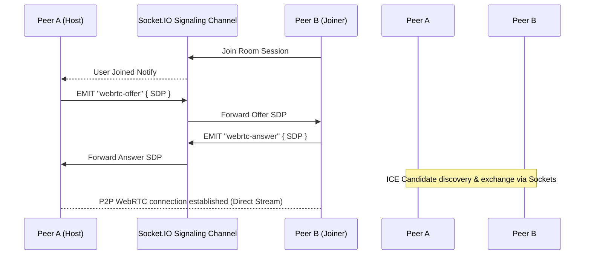

# CodeCall System Architecture & Design Document

CodeCall is a real-time, full-stack collaborative IDE, whiteboard, and communication platform designed for high performance, secure sandboxed execution, and low-latency interaction.

---

## 1. System Overview

CodeCall operates on a hybrid architecture combining a standard REST API, persistent bidirectional WebSockets, and direct Peer-to-Peer (P2P) WebRTC communication.

---

## 2. Component Design & Directory Structure

### 2.1 Frontend Architecture (Vite + React)
The frontend utilizes a modular hook-based architecture to isolate presentation layers (components) from underlying socket connections and state sync channels.

*   **View Layer (Pages/Components):** React views handle UI renders. Inputs are piped directly into custom state sync hooks.
*   **Custom Hooks (State Synchronization):**
    *   [useWebRTC.js](file:///d:/projects/CodeCall/frontend/src/hooks/useWebRTC.js) — Coordinates camera feeds, mic controls, local streams, and WebRTC P2P mesh connection lifecycle.
    *   `useCodeSync()` — Intercepts Monaco Editor onChange events, debounces changes, and synchronizes workspace cursors/edits.
    *   `useWhiteboard()` — Handles HTML5 canvas drawing offsets, drawing status, and vector coordinate transmissions.
*   **Core Services:**
    *   `api/` — Houses modular Axios configurations. Interceptors attach Bearer JWTs to headers and monitor expiration codes to trigger automatic refresh token handshakes.
    *   `socket/` — Singleton client instance managing socket connection attempts, auto-reconnect logic, and socket channel events.

### 2.2 Backend Architecture (Node.js + Express + Prisma)
The backend follows a Controller-Service-Repository modular pattern to isolate database querying from routing environments.

*   **Routing & Controller Layer:** Parses request bodies, enforces type checks using Zod middleware, and routes requests to execution services.
*   **Business Logic (Service Layer):** Contains pure, testable service modules (e.g. `auth.service`, `project.service`, `room.service`) that handle DB writes, notifications, and integration logic.
*   **Real-time Layer (Sockets):** Socket.IO namespace managers intercept WebRTC signaling requests, coordinate canvas vector operations, and broadcast Monaco edits.
*   **Background Jobs Layer:** BullMQ runs worker processes asynchronously (utilizing Redis connection limits) to dispatch mailings or run log cleaning operations.

---

## 3. Database Entity Relationship Diagram (ERD)

Prisma ORM models relational models mapping user accounts, active workspaces, and invites.

---

## 4. Real-time Communication & Protocols

### 4.1 Monaco Code Editor Synchronization
To prevent race conditions during collaborative typing, Monaco editor keystrokes are synchronized across the Socket.IO workspace room.

### 4.2 WebRTC Peer-to-Peer Video/Audio Signaling
WebRTC connections bypass the main servers during streaming. However, standard P2P sessions require a signaling mechanism to negotiate connection terms. CodeCall uses Socket.IO rooms as the signaling channel.

---

## 5. Security & Isolation Architectures

CodeCall is designed with a defense-in-depth approach to ensure database integrity, network safety, and compute environment safety:

1.  **Code Execution Isolation (Sandboxing):**
    User code is handled as untrusted data. Instead of executing code locally on the host server, payloads are sent via Axios post calls to **Judge0 CE** sandbox containers. Sandbox policies enforce hard timeouts, memory limit constraints, and disabled network adapters, neutralising malware, fork bombs, and command injection attacks.
2.  **Stateless JWT Strategy with Rotation:**
    *   **Access Token:** Short-lived tokens (15m) issued in headers.
    *   **Refresh Token:** Long-lived tokens (7d) stored securely in the database. When access tokens expire, a verification handshake automatically verifies the refresh token, invalidates the old credentials, rotates the refresh token database entry, and returns a new access/refresh pair, mitigating replay attacks.
3.  **Input Schema Validation:**
    All ingress API routes and WebSocket event listeners validate incoming parameters against predefined **Zod schemas**. Non-conforming bodies are rejected before entering business logic functions.
4.  **CORS & Helmet Header Guard:**
    *   **Helmet:** Attaches security headers, enforcing frame options, XSS protections, and referer-policies.
    *   **CORS:** Production middleware checks the request origin and locks API usage exclusively to the client URL configuration.