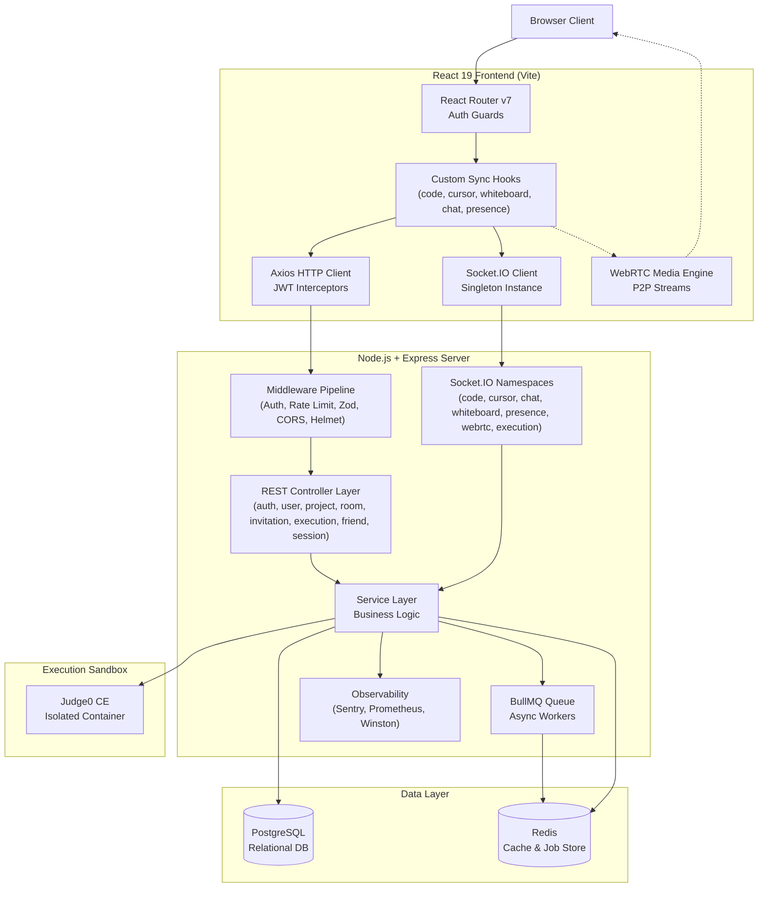
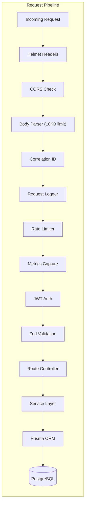
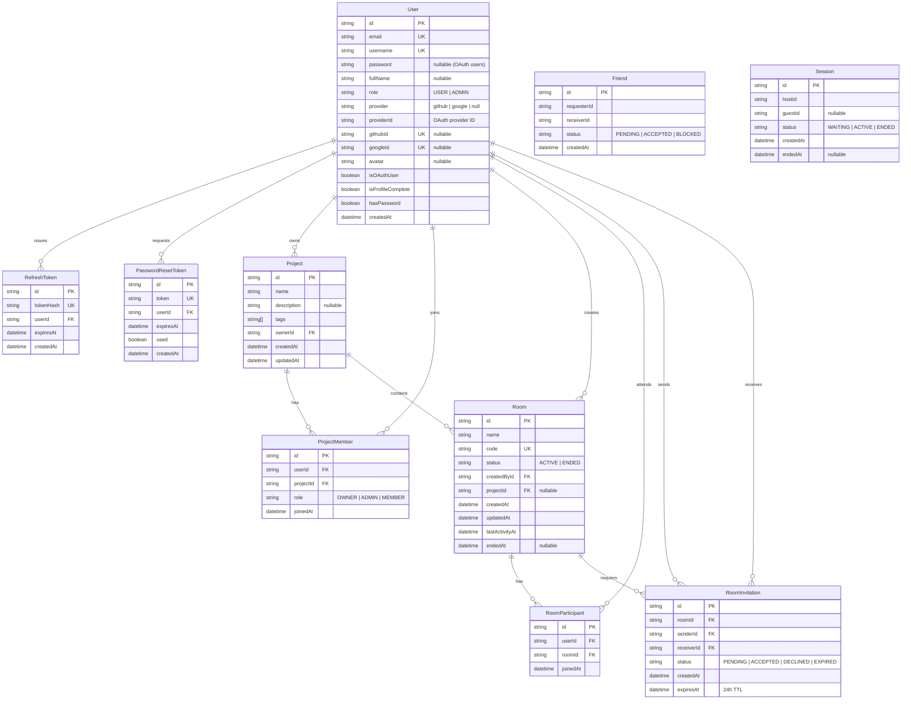
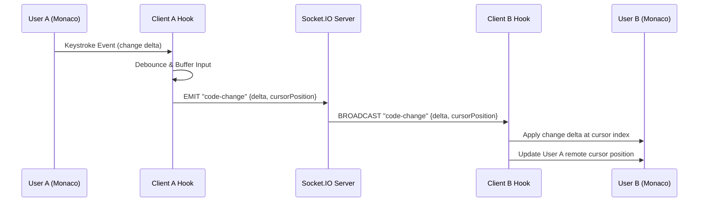
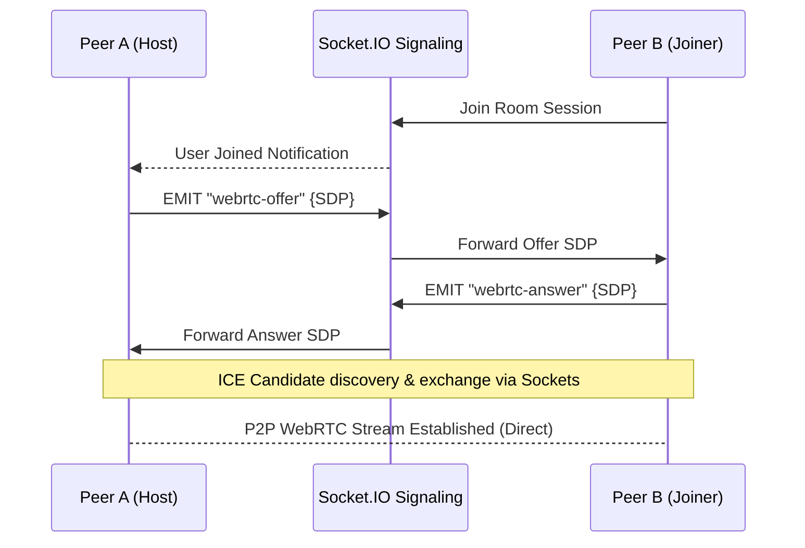
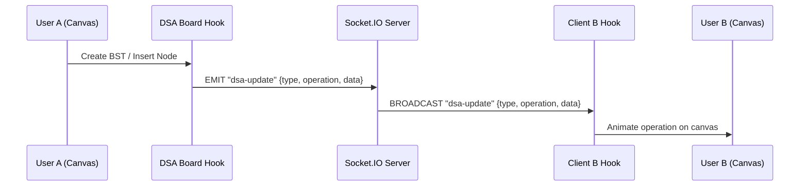
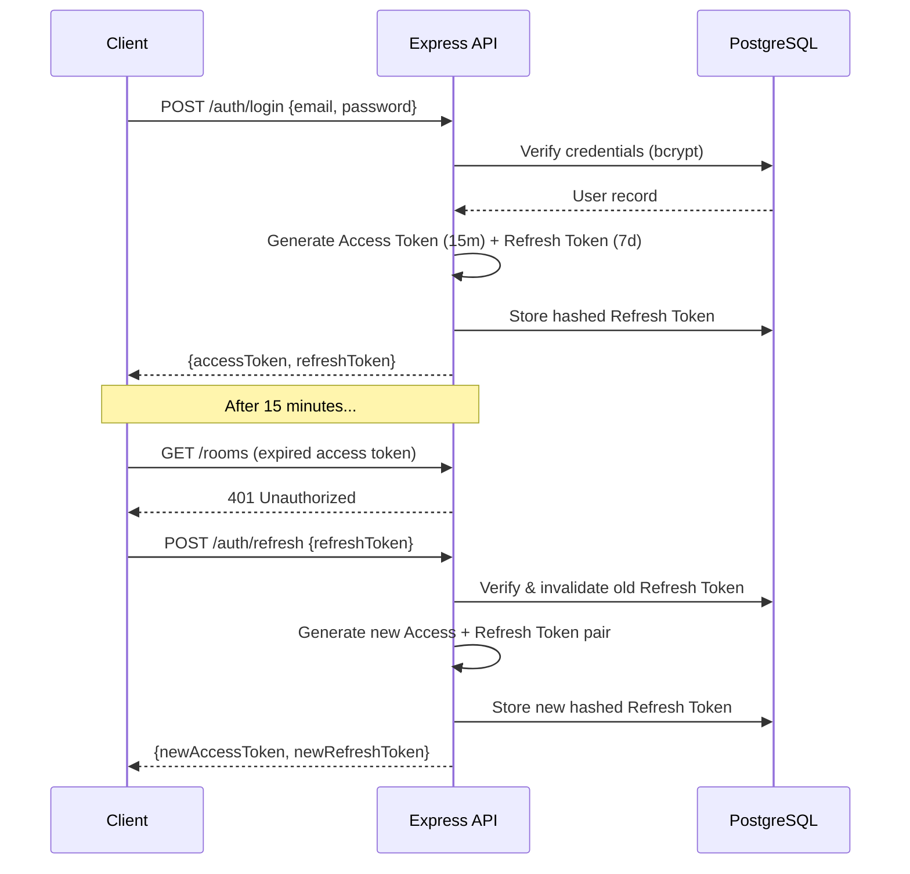

# CodeCall — System Architecture & Design Document

CodeCall is a real-time collaborative platform with coding, whiteboard, DSA board and communication tools. This document details the system architecture, data model, communication protocols, and security design.

---

## 1. System Overview

CodeCall operates on a **hybrid architecture** combining a REST API layer, persistent bidirectional WebSockets, and direct Peer-to-Peer (P2P) WebRTC streaming.



---

## 2. Component Architecture

### 2.1 Frontend Architecture (Vite + React 19)

The frontend uses a **modular hook-based architecture** that isolates the presentation layer (components/pages) from real-time state synchronization and network communication.

#### View Layer
- **Pages** render route-level views (Dashboard, RoomSession, Settings, etc.)
- **Components** are reusable UI elements (ProjectCard, RoomCard, ConfirmModal, CodeEditor, DSACanvas)
- All interactive elements use inline rename patterns with Enter-to-confirm/Escape-to-cancel UX

#### Custom Hooks (State Synchronization)
| Hook | Responsibility |
|---|---|
| `useCollaborativeCode` | Intercepts Monaco `onChange` events, debounces changes, and synchronizes edits across participants |
| `useCursors` | Broadcasts and renders remote cursor positions with per-user color coding |
| `useWhiteboard` | Handles HTML5 canvas drawing and coordinate transmission |
| `useDSABoard` | Manages data structure creation, manipulation, and animation state |
| `useWebRTC` | Coordinates camera/mic streams, P2P mesh connections, and ICE candidate exchange |
| `useChat` | Manages scoped in-room live chat message state |
| `usePresence` | Tracks user online/away status and activity indicators |
| `useCodeExecution` | Submits code to the execution API and receives results |
| `useSocket` | Manages socket connection lifecycle and auto-reconnection |

#### Core Services
- **`api/axios.js`** — Axios instance with interceptors that inject `Authorization: Bearer` headers and trigger automatic token refresh on 401 responses
- **`socket/socket.js`** — Singleton Socket.IO client managing connection lifecycle, auto-reconnect logic, and event channel routing
- **`context/UserContext.jsx`** — React Context providing global authentication state, user profile data, and login/logout actions

### 2.2 Backend Architecture (Node.js + Express + Prisma)

The backend follows a **Controller → Service → Repository** modular pattern with domain-driven feature modules.



#### Module Organization
Each domain module follows the same structure: `controller.js` → `service.js` → `routes.js` (+ optional `validators.js`)

| Module | Endpoints | Description |
|---|---|---|
| **auth** | `/api/auth/*` | Login, signup, OAuth callbacks, token refresh, password reset |
| **user** | `/api/users/*` | Profile retrieval, settings update, avatar management |
| **project** | `/api/projects/*` | CRUD operations, membership management, tag categorization |
| **room** | `/api/rooms/*` | Room lifecycle (create, join, rename, end), participant tracking |
| **invitation** | `/api/invitations/*` | Send, accept, decline room invitations with 24h expiry |
| **execution** | `/api/execution/*` | Code submission proxy to Judge0 sandbox |
| **friend** | `/api/friends/*` | Friend request, accept, block system |
| **session** | `/api/sessions/*` | Legacy 1-on-1 session management |
| **health** | `/api/health` | Server health check |
| **metrics** | `/metrics` | Prometheus metrics endpoint |

#### Socket.IO Event Namespaces
| Handler | Events | Description |
|---|---|---|
| `code.socket` | `code-change`, `code-sync` | Collaborative editor content synchronization |
| `cursor.socket` | `cursor-move`, `cursor-leave` | Remote cursor position broadcasting |
| `chat.socket` | `chat-message` | Scoped in-room text messaging |
| `whiteboard.socket` | `draw-start`, `draw-move`, `draw-end`, `clear` | Canvas vector coordinate transmission |
| `presence.socket` | `user-join`, `user-leave`, `typing` | User presence and activity indicators |
| `webrtc.socket` | `offer`, `answer`, `ice-candidate` | WebRTC signaling for P2P connections |
| `execution.socket` | `execution-result` | Code execution result broadcasting |

#### Background Processing
- **BullMQ** (`queues/job.queue.js`) defines Redis-backed queues for asynchronous tasks
- **Workers** (`workers/job.workers.js`) process jobs including email dispatch and maintenance operations

---

## 3. Database Entity Relationship Diagram

Prisma ORM manages all relational models. The schema includes user accounts, authentication tokens, social features, project workspaces, rooms, and invitations.



---

## 4. Real-Time Communication Protocols

### 4.1 Monaco Code Editor Synchronization

Collaborative typing is synchronized via Socket.IO room-scoped broadcasts. Change deltas and cursor positions are debounced to reduce network overhead.



### 4.2 WebRTC Peer-to-Peer Video/Audio

WebRTC connections bypass the server during active streaming. Socket.IO rooms serve as the **signaling channel** to negotiate connection terms (SDP offers/answers and ICE candidates).



### 4.3 DSA Canvas Synchronization

Data structure operations (create, insert, delete, traverse) are broadcast to all room participants. The DSA visualizer supports Arrays, Linked Lists, BSTs, and Graphs with animated step-through.



### 4.4 Whiteboard Drawing Sync

Canvas drawing events are transmitted as vector coordinates with optimized point batching for smooth rendering across peers.

---

## 5. Authentication & Authorization Flow

### 5.1 JWT Token Lifecycle



### 5.2 OAuth Flow (Google / GitHub)

1. Client redirects to provider authorization URL
2. Provider redirects back with authorization code
3. Backend exchanges code for provider access token
4. Backend fetches user profile from provider API
5. If user exists (matched by provider ID or email) → link account & issue JWTs
6. If new user → create account, mark `isProfileComplete: false` → redirect to profile completion page

---

## 6. Security Architecture

CodeCall implements a **defense-in-depth** strategy across all system layers:

### 6.1 Code Execution Isolation
User code is treated as **untrusted data**. Instead of local execution, payloads are proxied to **Judge0 CE** sandbox containers that enforce:
- Hard execution timeouts
- Memory limit constraints
- Disabled network adapters
- Process isolation (neutralizes fork bombs, command injection, and malware)

### 6.2 Network Security
| Layer | Mechanism | Configuration |
|---|---|---|
| **HTTP Headers** | Helmet.js | XSS protection, frame options, referrer policy, HSTS |
| **CORS** | Express CORS | Origin locked to `CLIENT_URL` in production |
| **Request Size** | Body Parser | 10KB limit to prevent buffer overflow payloads |
| **Rate Limiting** | express-rate-limit | Request count caps per IP window |
| **Speed Limiting** | express-slow-down | Progressive delay on repeated requests |
| **Input Validation** | Zod schemas | All API inputs validated before entering business logic |

### 6.3 Authentication Security
| Feature | Implementation |
|---|---|
| **Password Hashing** | bcrypt with auto-generated salt rounds |
| **Access Tokens** | Short-lived JWT (15m), stateless verification |
| **Refresh Tokens** | Long-lived (7d), hashed in database, single-use with rotation |
| **Token Rotation** | Old refresh token invalidated on every refresh, preventing replay attacks |
| **Password Reset** | Time-bound tokens with one-time use enforcement |
| **OAuth Account Linking** | Provider IDs prevent duplicate accounts (`@@unique([provider, providerId])`) |

### 6.4 Error Handling & Observability
- **Sentry** captures unhandled exceptions with full stack traces and distributed tracing
- **Winston** logs structured JSON with correlation IDs for request tracing
- **Prometheus** exposes HTTP duration histograms and Node.js runtime metrics at `/metrics`
- **Custom `AppError` class** with centralized error codes ensures consistent API error responses

---

## 7. Middleware Pipeline

Every incoming HTTP request passes through the following middleware chain in order:

```
Helmet → CORS → Body Parser (10KB) → Correlation ID → Request Logger → Rate Limiter → Speed Limiter → Metrics Capture → JWT Authentication → Zod Validation → Route Controller → Error Handler
```

Socket.IO connections authenticate via the JWT token passed during the initial handshake, granting access to room-scoped event namespaces.

---

## 8. Deployment Considerations

### Required Services
- **PostgreSQL** — Primary database (managed or self-hosted)
- **Redis** — Required for rate limiting, response caching, and BullMQ job queues
- **Judge0 CE** — Self-hosted or third-party sandbox for code execution
- **SMTP Server** — For transactional emails (password reset, invitations)

### Optional Integrations
- **Sentry** — Error monitoring (configure via `SENTRY_DSN`)
- **Prometheus + Grafana** — Metrics dashboard (scrape `/metrics` endpoint)
- **GitHub / Google OAuth** — Federated login (configure client ID/secret pairs)